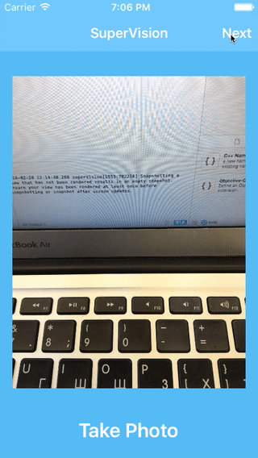

# Google Cloud Vision API iOS Demo



## For Quick Start Usage

1. Clone Repository
2. In 'ResultsController.swift' file enter your api key for CloudVision:
```swift
let apiKey = "YOUR_API_KEY"
```
